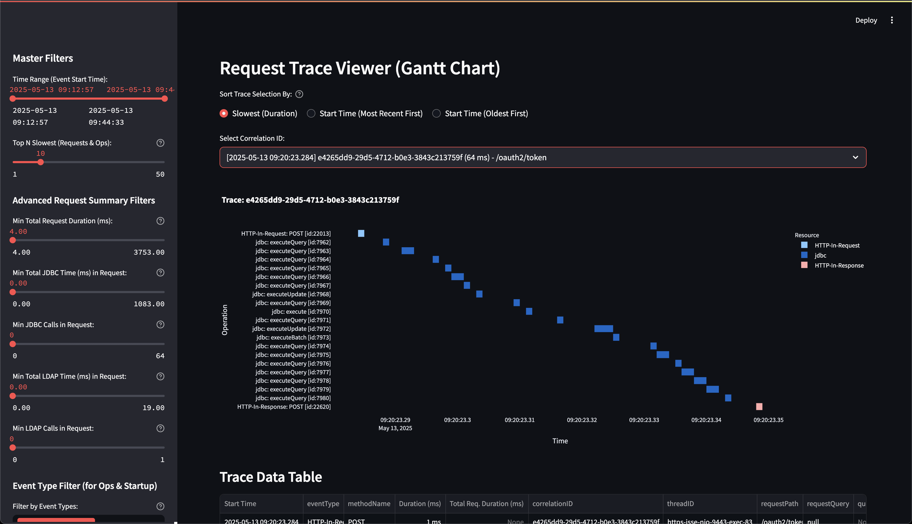

# WSO2 Identity Server Correlation Log Analyzer

This Streamlit application provides an interactive way to analyze WSO2 Identity Server correlation logs to identify performance issues, bottlenecks, and understand request flows. It parses complex, pipe-delimited log files, processes the data, and presents it through various visualizations and filterable tables.

---

## Features

* **Flexible File Upload:**
    * Supports uploading multiple individual correlation log files (`.log`, `.csv`).
    * Handles common archive formats (`.zip`, `.gz`, `.tar.gz`, `.tgz`), automatically extracting and processing relevant log files within.
* **Log Parsing & Categorization:**
    * Identifies different types of log entries (JDBC, LDAP, HTTP Inbound/Outbound Requests & Responses) based on their structure and content.
    * Handles variations in log formats and column counts.
    * Reports on unknown or malformed log entries.
* **Data Processing & Summarization:**
    * Converts raw log data into structured DataFrames.
    * Standardizes event types across different log sources.
    * Performs crucial data type conversions (timestamps to datetime, durations to numeric).
    * Calculates a comprehensive summary for each unique `correlationID`, including:
        * Request start and end times.
        * Total calculated request duration (in milliseconds).
        * Reported total duration from logs.
        * Request path.
        * Number of JDBC and LDAP calls within the request.
        * Total time spent in JDBC and LDAP operations within the request.
        * Calculated HTTP/other processing overhead.
* **Interactive Dashboard:**
    * **KPIs:** Displays key performance indicators such as the total number of filtered requests, average request duration, and P95 request duration (all in milliseconds).
    * **Performance Trends Over Time:**
        * A merged chart showing:
            * Request Count (as bars, secondary Y-axis).
            * Avg Response Time (ms, dotted line, primary Y-axis).
            * P95 Response Time (ms, dotted line, primary Y-axis).
            * Avg JDBC Time per request (ms, line, primary Y-axis).
            * Avg LDAP Time per request (ms, line, primary Y-axis).
        * Allows resampling data by various time frequencies (15s, 30s, 1 Min, 10 Mins, Hourly, Daily).
    * **Filterable Tables:**
        * **Slowest Requests Analysis:** Lists requests sorted by duration, with details on JDBC/LDAP calls and their timings.
        * **Slowest Individual Operations:** Lists the slowest individual JDBC, LDAP, or HTTP operations.
        * **Startup Operations Analysis:** Details operations that occurred without a standard `correlationID` (often during server startup).
        * All tables include a "Show all filtered items" checkbox to toggle between a "Top N" view and the complete filtered dataset.
        * Durations are displayed in milliseconds, and timestamps show milliseconds up to 3 digits.
    * **Request Trace Viewer (Gantt Chart):**
        * Allows users to select a specific `correlationID` from a dropdown.
        * The dropdown can be sorted by:
            * Slowest request (duration, descending) - Default.
            * Request start time (most recent first).
            * Request start time (oldest first).
        * Dropdown entries are formatted as: `[YYYY-MM-DD HH:MM:SS.mmm] CorrelationID (Duration ms) - RequestPath`.
        * Displays a Plotly Gantt chart visualizing all operations within the selected trace, ordered chronologically by their start times.
        * Provides a detailed data table for all operations in the selected trace.
    * **Advanced Filtering:**
        * Master time range filter based on event `startTime`.
        * "Top N" selector for summary tables.
        * Filters for request summary table: Min Total Request Duration (ms), Min Total JDBC Time (ms), Min JDBC Calls, Min Total LDAP Time (ms), Min LDAP Calls.
        * Event type filter for "Individual Operations" and "Startup Operations" views.
    * **Data Exploration:**
        * Expanders to show raw filtered operational data and details of any unknown rows encountered during parsing.
* **Performance:**
    * Uses Streamlit's caching (`@st.cache_data`) for expensive data loading and processing steps to ensure responsiveness after the initial load.

---

## Screenshots

<table>
  <tr>
    <td></td>
    <td></td>
    <td></td>
  </tr>
  <tr>
    <td align="center"><em>Application title screen</em></td>
    <td align="center"><em>Analysis overview</em></td>
    <td align="center"><em>Slowest individual operations</em></td>
  </tr>
  <tr>
    <td></td>
    <td></td>
    <td></td>
  </tr>
  <tr>
    <td align="center"><em>Slowest startup operations</em></td>
    <td align="center"><em>Request tracer Gantt chart</em></td>
    <td align="center"><em>Request tracer data</em></td>
  </tr>
</table>

---

## How to Use

1.  **Prerequisites:**
    * Python 3.8+
    * Install required libraries:
        ```bash
        pip install streamlit pandas plotly
        ```
      or use the provided `requirements.txt` file:
        ```bash
        pip install -r requirements.txt
        ```


2.  **Run the Application:**
    * Save the script as a Python file (e.g., `log_analyzer.py`).
    * Open your terminal or command prompt.
    * Navigate to the directory where you saved the file.
    * Run the command:
        ```bash
        streamlit run log_analyzer.py
        ```
    * The application will open in your default web browser.

3.  **Upload Log Files:**
    * Click the "Browse files" button or drag and drop your WSO2 IS correlation log files onto the uploader.
    * You can upload:
        * Single `correlation.log` (or `.csv`) files.
        * Multiple rotated log files (e.g., `correlation.log`, `correlation.log.1`, `correlation.log.2`).
        * Supported archives (`.zip`, `.gz`, `.tar.gz`, `.tgz`) containing these log files. The application will attempt to extract and process log files named with "correlation.log" in their path.

4.  **Analyze Data:**
    * Once the files are processed, the dashboard will populate.
    * Use the **sidebar filters** to narrow down the data:
        * **Time Range:** Select a specific period to analyze.
        * **Top N Slowest:** Adjust how many items appear in the "slowest" tables.
        * **Advanced Request Summary Filters:** Fine-tune the requests displayed in the "Slowest Requests Analysis" and "Performance Trends Over Time" sections based on total duration, and JDBC/LDAP activity.
        * **Event Type Filter:** Select specific event types for the "Individual Operations" and "Startup Operations" views.
    * **Explore KPIs:** Get a quick overview of request counts and latencies.
    * **Examine Performance Trends:** Use the time series chart to see how request counts, average/P95 response times, and average JDBC/LDAP times per request evolve over time. Change the resampling frequency for more or less granularity.
    * **Identify Slow Operations:**
        * Check the "Slowest Requests Analysis" table for overall slow user requests.
        * Dive into the "Slowest Individual Operations" table to pinpoint specific slow backend calls (JDBC, LDAP, etc.).
    * **Trace Specific Requests:**
        * Use the "Request Trace Viewer" section.
        * Choose a sort order for the dropdown (by duration or start time).
        * Select a `correlationID` from the dropdown.
        * Analyze the Gantt chart to see the sequence and duration of all operations within that request.
        * Review the accompanying data table for precise values.
    * **Review Startup Behavior:** Check the "Startup Operations Analysis" if you suspect issues during server initialization.
    * **Inspect Raw/Unknown Data:** Use the expanders at the bottom if you need to see the filtered raw log entries or details about rows the parser couldn't categorize.

---

## Log File Format Expectations

* The application expects pipe-delimited (`|`) CSV-like files.
* It identifies log entry types based on the value in the 5th column (index 4) and the total number of columns, as defined in `ROW_TYPE_CONFIG`.
* Key columns expected include `correlationID`, `startTime` (as Unix milliseconds epoch), `eventType` or `callType`, `duration`, `totalDurationForRequest`, etc., depending on the log type.
* Timestamps in the first column of JDBC/LDAP logs are expected in the format `YYYY-MM-DD HH:MM:SS,microseconds` (e.g., `2023-10-27 10:30:00,123456`).

---

## Future Considerations / Potential Enhancements

* Support for additional archive formats (e.g., `.7z` via `py7zr`).
* More sophisticated heuristics for identifying log files within archives.
* More advanced statistical analysis or anomaly detection features.
* User-configurable thresholds (e.g., for P95 minimum samples).
* Exporting filtered data or charts.
* Theming and UI customization options.
